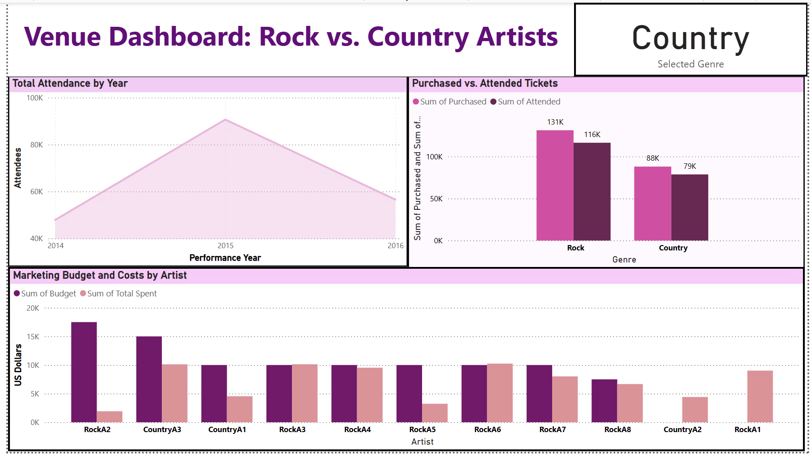
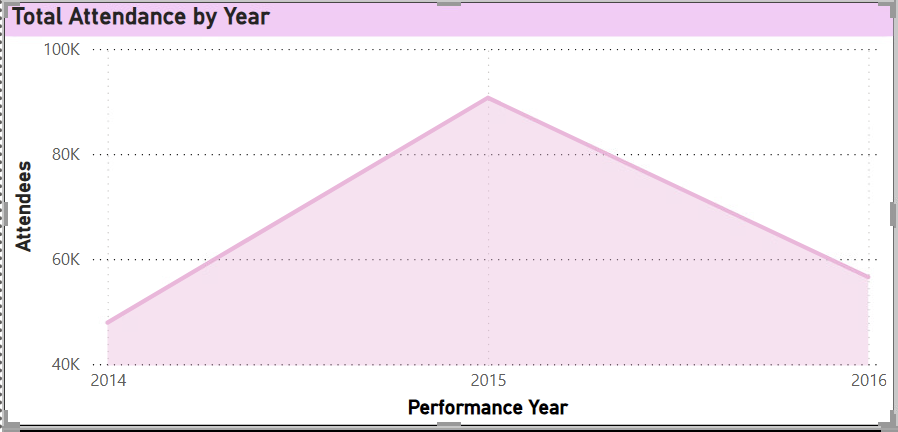
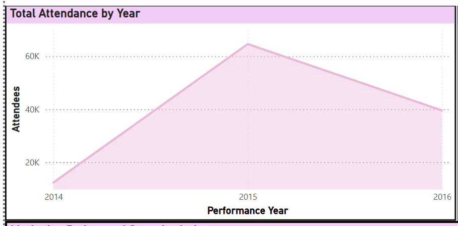
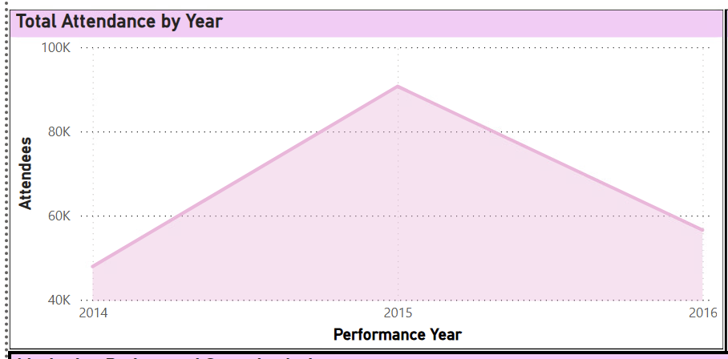
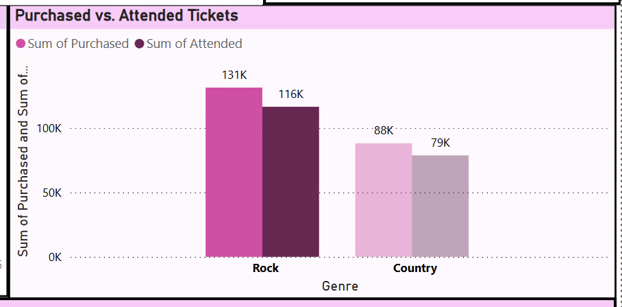
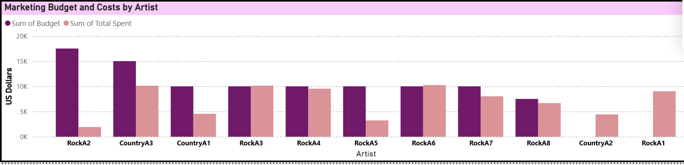
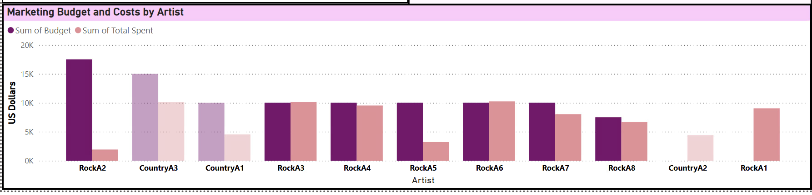

## Concert Venue Power BI Dashboard Creation 🎶
---
The concert venue provided two excel files, one that compiled attendance and attendance cost related informationand another that contained the marketing data for the artists. The attendance 
data included information about the number of tickets purchased and the actual number of tickets that were redeemed on the conert day for entry into the venue. The marketing data was split 
between the marketing budget and money actually spent. 

## Data Cleaning and Preparation 🧹
---
The raw data files contained information about every genre of artist and every concert held at the venue. To begin, the data was filtered to only include the two genres of interest, Rock and 
Coutnry. Addtional data prep included: 
* The data originally contained both a 'Rock' variable and a 'Classic Rock' varibale, the data was tranformed so that the 'Classic Rock' genre was also just 'Rock'
* Several of the bands had openers listed in their names as well, the names were corrected to only show the main band
* It was noted that marketing data was not provided for all the Rock or Country artists
* To protect the company's data privacy, the band names for Rock artists were altered to a "RockA1" and Country artists were altered to "CountryA1"

## Data Stats 📊
---
* The filtered data contains 23 Rock artists and 11 Country artists
* Marketing data was only provided for 8 Rock artists and 3 Country artists, but for one of the country artists and one of the rock artists only have marketing money spent and not budget info
* The data spans 2014 to 2016

## Dashboard Breakdown 👾

  

**Total Attendance**

The dashboard has an area chart visual that displays the total attendance for all three years. This visual can also be filtered to display attendance for Rock or Country genres only. 

<table>
  <tr>
    <td align="center">
       
      Total Attendance
    </td>
    <td align="center">
       
      Rock Attendance
    </td>
    <td align="center">
       
      Country Attendance
    </td>
  </tr>
</table>

**Tickets Purchased vs. Tickets Redeemed**

The concert venue tracks tickets sold and tickets redeemed at the venue for entry. This relationship was explored to see if they was a discrepancy between tickets bought and tickets redeemed. 
This visual can be filtered by genre but can also dynamically show the tickets purchased/redeemed for each artist. 

  

**Marketing Data**

Marketing data was not provided for every artist. But for several of them, the marketing budget and actual money spent were provided and put into a var chart visual. This visual could be filtered
by genre and artist as needed. 

  

Marketing data filtered for Country artists.

  

Marketing data filtered for Rock artists. 

---

## Recommendations and Conclusions ‼
---

The final recommendation from this project is that the concerrt venue should add more Rock artists to their upcoming concert season. Overall, the venue already showcases more Rock artists 
than country so that is a factor to consider in our analysis. However, the Rock concerts have high attendance and meet the goals of the venue, and by choosing more Rock artists than Country 
artists has the potential to bring in more revenue and increased attendance. 

In terms of attendance, the Rock concerts made up 60% of total attendance. In terms of individual concert attendance, Rock concerts saw a higher average attendance per concert in terms of 
tickets redeemed at entry. However, it was noted that there was indeed a discrpency between number of tickets purchased and number of tickets redeemed at the venue doors for entry. About, 12%
and 11% for Rock and Country respectively. 

For marketing expenses, there was some variability in the amount of money spent on each concert, but overall, Rock concerts spent on average more on marketing than Country artists. Two Rock 
bands spent over their allotted marketing budget. 

Based on this information, the final recommednation is that the venue choose to add more Rock artists over Country artists for their upcoming concert season. It is also recommended that the 
venue's marketing team conduct an investigation to ensure they are spending enough money to market their bands without overspending. 

